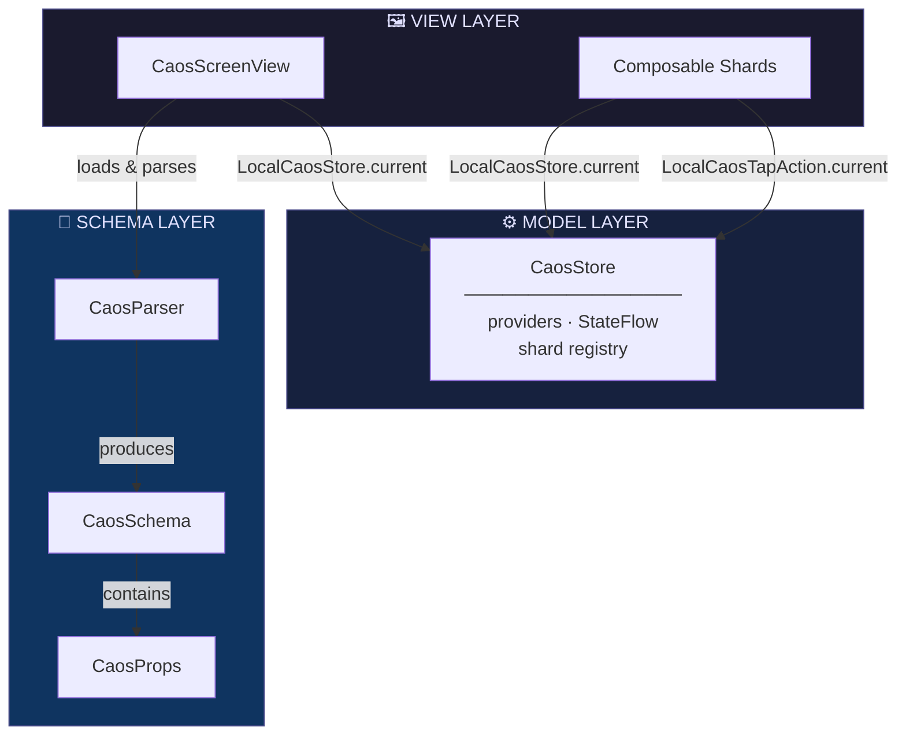

# Caos Android

[](https://github.com/andersontizaias/caos-android/actions/workflows/ci.yml)
[](https://github.com/andersontizaias/caos-android/actions/workflows/lint.yml)
[](https://developer.android.com/)
[](https://kotlinlang.org)
[](LICENSE)

**Caos** (**C**onfigurable **A**utomated **O**n-demand **S**creens) é um framework de
Server-Driven UI para Android que gera telas Jetpack Compose dinamicamente a partir de arquivos
YAML. Mude sua UI sem redeploy do app.

Port em Kotlin/Jetpack Compose de [Caos](https://github.com/andersontizaias/Caos) (SwiftUI) — o
mesmo arquivo `caos.yaml` funciona nas duas plataformas sem modificação. Veja
[`PLAN_ANDROID.md`](./PLAN_ANDROID.md) pro mapeamento completo de API Swift → Kotlin e as
decisões de arquitetura por trás de cada diferença deliberada entre as duas versões.

---

## Architecture



Caos segue o padrão **MV (Model-View)** — sem ViewModel. `CaosStore` é o Model; composables leem
dele via `LocalCaosStore.current`.

---

## Requirements

### Runtime

| Requirement | Minimum | Notes |
|---|---|---|
| Android | API 24 (7.0) | `minSdk` |
| Kotlin | 2.3.21 | |
| Jetpack Compose | BOM 2026.05.00 | |
| JDK | 21 | build |

### Framework dependencies

| Dependency | Type | Purpose |
|---|---|---|
| Jetpack Compose (runtime/ui/foundation/material3) | AndroidX | Rendering engine |
| `kotlinx-coroutines-core` | Library | Data binding reativo via `CaosStore` (`StateFlow`) |
| **Nenhuma dependência de terceiros em `caos-core`** | — | Parser é stdlib-only, zero pacotes externos |

### Local development tools

| Tool | Notes |
|---|---|
| Android Studio ou JDK 21 | Ex.: JBR do Android Studio (`/Applications/Android Studio.app/Contents/jbr`) |
| Android SDK | `compileSdk`/`targetSdk` 36 |

---

## Local Development

### 1. Clone

```bash
git clone https://github.com/andersontizaias/caos-android.git
cd caos-android
```

### 2. Build

```bash
./gradlew build
```

### 3. Run tests

```bash
# ktlint + Spotless + detekt + testes (JVM e Robolectric) + cobertura (Kover, limiar 90%)
# em todos os módulos — as tasks já se encadeiam automaticamente via `check`
./gradlew check
```

### 4. Run the sample app

```bash
./gradlew :caos-sample:installDebug
```

Ou abra o projeto no Android Studio e rode a configuração `caos-sample`.

### 5. Validate a YAML file

```bash
./gradlew :caos-lint:run --args="path/to/file.yaml"
```

### Project structure

```
caos-android/
├── caos-core/               # Kotlin puro (sem Android) — CaosParser, CaosProps, CaosSchema, CaosShard
├── caos-compose/            # Jetpack Compose — CaosStore, CaosScreenView, CaosContainerView, …
├── caos-lint/                # CLI de validação (JVM, plugin `application` + `shadow`)
├── caos-sample/               # App de exemplo — Quick Start abaixo
├── PLAN_ANDROID.md            # Arquitetura completa e mapeamento Swift → Kotlin
├── .github/workflows/         # ci.yml, lint.yml, release.yml
└── version.txt                # Fonte única de verdade da versão
```

---

## Quick Start

**1. Add YAML** (`home.yaml` em `src/main/assets/`):

```yaml
version: 1
screens:
  - id: home
    container:
      type: vertical
      spacing: 16
      padding:
        top: 24
        bottom: 24
        leading: 16
        trailing: 16
    shards:
      - type: BalanceCard
        id: card_balance
        props:
          # "id" repetido aqui de propósito — nem CaosContainerView (Compose) nem a versão Swift
          # injetam o id do shard dentro de `props` automaticamente, então o shard só consegue
          # disparar onTap com o id certo se ele mesmo estiver acessível via props.
          id: "card_balance"
          title: "Saldo disponível"
          dataKey: "user.balance"
          cornerRadius: 12
```

**2. Set up sua Activity:**

```kotlin
class MainActivity : ComponentActivity() {

    private val store =
        CaosStore().apply {
            register(type = "BalanceCard") { props -> BalanceCardView(props) }
            register(key = "user.balance") { UserSession.formattedBalance }
        }

    override fun onCreate(savedInstanceState: Bundle?) {
        super.onCreate(savedInstanceState)
        setContent {
            CaosScreenView(
                name = "home",
                store = store,
                onTap = { id, context -> Log.d("Caos", "Tapped shard: $id $context") },
            )
        }
    }
}
```

Pronto. `CaosScreenView` carrega o YAML dos assets, resolve cada tipo de shard no store e
renderiza a tela. Veja o módulo [`caos-sample`](./caos-sample) pro exemplo completo, rodável.

---

## YAML Schema Reference

| Field | Type | Required | Description |
|---|---|---|---|
| `version` | Int | ✅ | Sempre `1` |
| `screens` | List | ✅ | Array de definições de tela |
| `screens[].id` | String | ✅ | Identificador único da tela |
| `screens[].container.type` | String | ✅ | `vertical` \| `horizontal` \| `grid` |
| `screens[].container.spacing` | Number | — | Espaço entre shards (dp) |
| `screens[].container.padding` | Object | — | `top`, `bottom`, `leading`, `trailing` |
| `screens[].shards` | List | — | Array de definições de shard |
| `shards[].type` | String | ✅ | Nome do tipo de shard registrado |
| `shards[].id` | String | — | Identificador único usado em eventos de tap |
| `shards[].props` | Object | — | Propriedades tipadas passadas pro shard |

Mesmo schema YAML v1 do repo Swift, sem modificação — ver os fixtures compartilhados em
`caos-core/src/test/resources/fixtures/`.

---

## CaosProps API

`CaosProps` encapsula o dicionário `props` do YAML e fornece acessores tipados:

| Method | Return | Description |
|---|---|---|
| `string(key)` | `String?` | Valor string cru |
| `int(key)` | `Int?` | Valor inteiro |
| `double(key)` | `Double` | Valor de ponto flutuante; default `0.0` |
| `bool(key)` | `Boolean?` | Booleano ou string `"true"`/`"false"` |
| `hexColor(key)` | `String?` | Valida e retorna string hex (`#RGB`, `#RRGGBB`, `#AARRGGBB`) |
| `nested(key)` | `CaosProps?` | Objeto aninhado |
| `array(key)` | `List<CaosProps>?` | Array de objetos |

> **Nota:** `hexColor()` valida o formato mas retorna uma `String`. Converter pra
> `androidx.compose.ui.graphics.Color` é responsabilidade do shard (`Color(android.graphics.Color.parseColor(hex))`).

---

## Registering Shards

Shards são funções `@Composable`. Não existe um protocolo tipo `CaosSwiftUIView` — uma função
`@Composable` já é a unidade de composição em Compose, então o registro é sempre por lambda.

```kotlin
store.register(type = "BalanceCard") { props -> BalanceCardView(props) }
```

### Implementando um shard

```kotlin
@Composable
fun BalanceCardView(props: CaosProps) {
    val store = LocalCaosStore.current
    val onTap = LocalCaosTapAction.current
    val balance = store.resolve<String>(props.string("dataKey") ?: "") ?: "--"

    Column(
        modifier =
            Modifier
                .background(Color.White, RoundedCornerShape(props.double("cornerRadius").dp))
                .clickable { onTap(props.string("id") ?: "", emptyMap()) }
                .padding(16.dp),
    ) {
        Text(props.string("title") ?: "", style = MaterialTheme.typography.titleMedium)
        Text(balance, style = MaterialTheme.typography.headlineSmall)
    }
}
```

---

## Data Binding with CaosStore

### Provider síncrono

```kotlin
store.register(key = "user.balance") { UserSession.formattedBalance }
```

### Provider reativo (`StateFlow`)

```kotlin
store.register(key = "user.balance", flow = userSession.balanceFlow)
```

### Lendo um valor reativo num shard

```kotlin
@Composable
fun LiveBalanceView(props: CaosProps) {
    val store = LocalCaosStore.current
    val key = props.string("dataKey") ?: return
    val flow = store.flowFor<String>(key) ?: return
    val balance by flow.collectAsState()

    Text(balance ?: "--", style = MaterialTheme.typography.headlineSmall)
}
```

---

## Tap Events

Todo shard pode disparar um evento de tap via `LocalCaosTapAction`. O `id` vem do campo `id:` do
shard no YAML — desde que também esteja repetido dentro de `props:` (ver nota no Quick Start).

**No shard:**

```kotlin
val onTap = LocalCaosTapAction.current
Modifier.clickable { onTap(props.string("id") ?: "", emptyMap()) }
```

**Tratando eventos no topo:**

```kotlin
CaosScreenView(
    name = "home",
    store = store,
    onTap = { id, context ->
        when (id) {
            "card_balance" -> navigateToBalance()
            else -> Unit
        }
    },
)
```

---

## Loading States

`CaosScreenView` mostra um `CircularProgressIndicator` enquanto o YAML carrega, depois renderiza a
tela ou uma mensagem de erro se o parse falhar.

Pra mostrar um shimmer de placeholder enquanto seu shard busca dado:

```kotlin
Text(
    text = balance ?: "",
    modifier = Modifier.caosShimmer(isActive = balance == null),
)
```

---

## YAML Validation (CLI)

```bash
# Via Gradle
./gradlew :caos-lint:run --args="home.yaml"

# Ou o fat jar standalone (anexado a cada GitHub Release)
java -jar caos-lint-1.0.0-all.jar home.yaml

# Output
✓ version: 1
✓ screens: 2 found
✓ shards: 5 found
⚠ Shard of type 'BannerView' in screen 'home' has no id
✅ No errors (1 warning(s))
```

---

## Installation

### Gradle (Maven Central)

> **Status:** o workflow de publicação (`release.yml`) está pronto, mas a publicação de verdade
> depende de secrets que ainda não existem no repo (conta no Central Portal, namespace verificado,
> chave GPG — detalhes na Fase 5 do [`PLAN_ANDROID.md`](./PLAN_ANDROID.md)). As coordenadas abaixo
> são as que serão usadas assim que a primeira release sair.

```kotlin
// settings.gradle.kts
dependencyResolutionManagement {
    repositories {
        mavenCentral()
    }
}
```

```kotlin
// build.gradle.kts (módulo do seu app)
dependencies {
    implementation("io.github.andersontizaias:caos-core:1.0.0")
    implementation("io.github.andersontizaias:caos-compose:1.0.0")
}
```

Enquanto isso, use como projeto Gradle local (composite build ou `includeBuild`) apontando pra
este repositório.

---

## Tabela de Paridade iOS vs Android

| Feature | iOS | Android |
|---|---|---|
| Parser YAML v1 (zero deps) | `CaosParser.swift` (`YAMLParser`) | `CaosParser.kt` (`CaosYamlParser`) |
| Propriedades tipadas | `CaosProps` (struct) | `CaosProps` (data class) |
| Registro de shards | closure explícita (`register(type:factory:)`) | closure explícita (`register(type:content:)`) |
| Container vertical/horizontal/grid | `LazyVStack`/`LazyHStack`/`LazyVGrid` (+ `ScrollView`) | `LazyColumn`/`LazyRow`/`LazyVerticalGrid` (autoscroll) |
| Data binding reativo | `CaosStore` + Combine (`CurrentValueSubject`) | `CaosStore` + Coroutines (`MutableStateFlow`) |
| Injeção de contexto | `@Environment(\.caosStore)` | `CompositionLocal` (`LocalCaosStore`) |
| Tap events | `@Environment(\.caosTapAction)` / `.onCaosTap` | `CompositionLocal` (`LocalCaosTapAction`) |
| Shard desconhecido | `CaosUnknownShardView` (`#if DEBUG`) | `CaosUnknownShardView` (`BuildConfig.DEBUG`) |
| Loading shimmer | `ShimmerModifier` / `.shimmer()` | `Modifier.caosShimmer()` |
| CLI de validação | `caos-lint` (SPM executable) | `caos-lint` (Gradle `application` + fat jar) |
| UI framework | SwiftUI (MV, sem ViewModel) | Jetpack Compose (mesmo padrão MV) |
| Distribuição | Swift Package Manager | Maven Central (config pronta, publish pendente de secrets) |
| Schema YAML | v1 compartilhado | v1 compartilhado, byte-a-byte |

Mapeamento completo de API, com o raciocínio por trás de cada diferença deliberada, em
[`PLAN_ANDROID.md`](./PLAN_ANDROID.md).

---

## Author

**Anderson Tiago Izaias** — [@andersontizaias](https://github.com/andersontizaias)

---

## License

Caos Android está disponível sob a licença MIT. Veja o arquivo [LICENSE](LICENSE) pra mais
informação.
