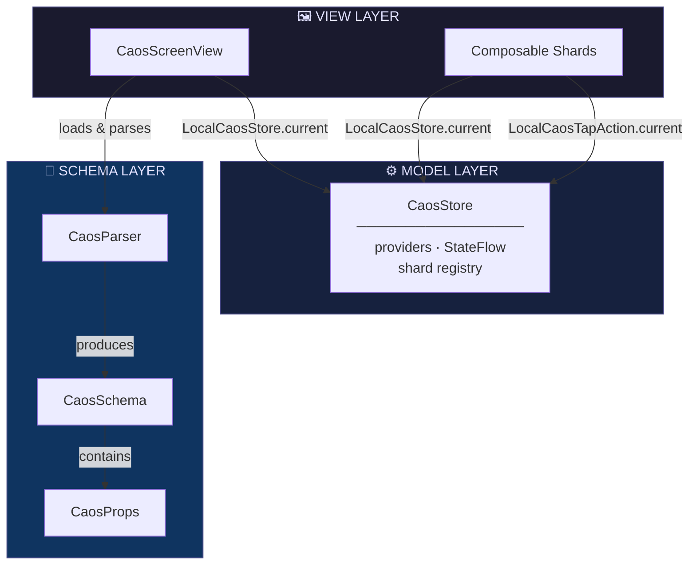

# Caos Android

[](https://github.com/andersontizaias/caos-android/actions/workflows/ci.yml)
[](https://github.com/andersontizaias/caos-android/actions/workflows/lint.yml)
[](https://developer.android.com/)
[](https://kotlinlang.org)
[](LICENSE)

<p align="center">
  
</p>

**Caos** (**C**onfigurable **A**utomated **O**n-demand **S**creens) is an Android Server-Driven UI
framework that generates Jetpack Compose screens dynamically from YAML files. Change your UI
without redeploying your app.

Kotlin/Jetpack Compose port of [Caos](https://github.com/andersontizaias/Caos) (SwiftUI) — the
same `caos.yaml` file works on both platforms without modification. See
[`PLAN_ANDROID.md`](./PLAN_ANDROID.md) for the full Swift → Kotlin API mapping and the reasoning
behind every deliberate difference between the two versions.

---

## Architecture



Caos follows the **MV (Model-View)** pattern — no ViewModel. `CaosStore` is the Model; composables
read from it via `LocalCaosStore.current`.

---

## Requirements

### Runtime

| Requirement | Minimum | Notes |
|---|---|---|
| Android | API 24 (7.0) | `minSdk` |
| Kotlin | 2.3.21 | |
| Jetpack Compose | BOM 2026.05.00 | |
| JDK | 21 | build |

### Framework dependencies

| Dependency | Type | Purpose |
|---|---|---|
| Jetpack Compose (runtime/ui/foundation/material3) | AndroidX | Rendering engine |
| `kotlinx-coroutines-core` | Library | Reactive data binding via `CaosStore` (`StateFlow`) |
| **No third-party dependencies in `caos-core`** | — | Parser is stdlib-only, zero external packages |

### Local development tools

| Tool | Notes |
|---|---|
| Android Studio or JDK 21 | E.g. Android Studio's bundled JBR (`/Applications/Android Studio.app/Contents/jbr`) |
| Android SDK | `compileSdk`/`targetSdk` 36 |

---

## Local Development

### 1. Clone

```bash
git clone https://github.com/andersontizaias/caos-android.git
cd caos-android
```

### 2. Build

```bash
./gradlew build
```

### 3. Run tests

```bash
# ktlint + Spotless + detekt + tests (JVM and Robolectric) + coverage (Kover, 90% threshold)
# across every module — these tasks already chain automatically via `check`
./gradlew check
```

### 4. Run the sample app

```bash
./gradlew :caos-sample:installDebug
```

Or open the project in Android Studio and run the `caos-sample` configuration.

### 5. Validate a YAML file

```bash
./gradlew :caos-lint:run --args="path/to/file.yaml"
```

### Project structure

```
caos-android/
├── caos-core/               # Pure Kotlin (no Android) — CaosParser, CaosProps, CaosSchema, CaosShard
├── caos-compose/            # Jetpack Compose — CaosStore, CaosScreenView, CaosContainerView, …
├── caos-lint/                # Validation CLI (JVM, `application` + `shadow` plugins)
├── caos-sample/               # Example app — Quick Start below
├── PLAN_ANDROID.md            # Full architecture and Swift → Kotlin mapping
├── .github/workflows/         # ci.yml, lint.yml, release.yml
└── version.txt                # Single source of truth for the version
```

---

## Quick Start

**1. Add YAML** (`home.yaml` in `src/main/assets/`):

```yaml
version: 1
screens:
  - id: home
    container:
      type: vertical
      spacing: 16
      padding:
        top: 24
        bottom: 24
        leading: 16
        trailing: 16
    shards:
      - type: BalanceCard
        id: card_balance
        props:
          # "id" repeated here on purpose — neither CaosContainerView (Compose) nor the Swift
          # version inject the shard's id into `props` automatically, so the shard can only
          # dispatch onTap with the right id if it's accessible via props too.
          id: "card_balance"
          title: "Available balance"
          dataKey: "user.balance"
          cornerRadius: 12
```

**2. Set up your Activity:**

```kotlin
class MainActivity : ComponentActivity() {

    private val store =
        CaosStore().apply {
            register(type = "BalanceCard") { props -> BalanceCardView(props) }
            register(key = "user.balance") { UserSession.formattedBalance }
        }

    override fun onCreate(savedInstanceState: Bundle?) {
        super.onCreate(savedInstanceState)
        setContent {
            CaosScreenView(
                name = "home",
                store = store,
                onTap = { id, context -> Log.d("Caos", "Tapped shard: $id $context") },
            )
        }
    }
}
```

That's it. `CaosScreenView` loads the YAML from assets, resolves each shard type from the store,
and renders the screen. See the [`caos-sample`](./caos-sample) module for the full, runnable
example.

---

## YAML Schema Reference

| Field | Type | Required | Description |
|---|---|---|---|
| `version` | Int | ✅ | Always `1` |
| `screens` | List | ✅ | Array of screen definitions |
| `screens[].id` | String | ✅ | Unique screen identifier |
| `screens[].container.type` | String | ✅ | `vertical` \| `horizontal` \| `grid` |
| `screens[].container.spacing` | Number | — | Space between shards (dp) |
| `screens[].container.padding` | Object | — | `top`, `bottom`, `leading`, `trailing` |
| `screens[].shards` | List | — | Array of shard definitions |
| `shards[].type` | String | ✅ | Registered shard type name |
| `shards[].id` | String | — | Unique identifier used in tap events |
| `shards[].props` | Object | — | Typed properties passed to the shard |

Same YAML v1 schema as the Swift repo, with no modification — see the shared fixtures in
`caos-core/src/test/resources/fixtures/`.

---

## CaosProps API

`CaosProps` wraps the YAML `props` dictionary and provides typed accessors:

| Method | Return | Description |
|---|---|---|
| `string(key)` | `String?` | Raw string value |
| `int(key)` | `Int?` | Integer value |
| `double(key)` | `Double` | Floating-point value; defaults to `0.0` |
| `bool(key)` | `Boolean?` | Boolean or string `"true"`/`"false"` |
| `hexColor(key)` | `String?` | Validates and returns a hex string (`#RGB`, `#RRGGBB`, `#AARRGGBB`) |
| `nested(key)` | `CaosProps?` | Nested object |
| `array(key)` | `List<CaosProps>?` | Array of objects |

> **Note:** `hexColor()` validates the format but returns a `String`. Converting to
> `androidx.compose.ui.graphics.Color` is the shard's responsibility
> (`Color(android.graphics.Color.parseColor(hex))`).

---

## Registering Shards

Shards are `@Composable` functions. There's no `CaosSwiftUIView`-style protocol — a `@Composable`
function is already the unit of composition in Compose, so registration is always by lambda.

```kotlin
store.register(type = "BalanceCard") { props -> BalanceCardView(props) }
```

### Implementing a shard

```kotlin
@Composable
fun BalanceCardView(props: CaosProps) {
    val store = LocalCaosStore.current
    val onTap = LocalCaosTapAction.current
    val balance = store.resolve<String>(props.string("dataKey") ?: "") ?: "--"

    Column(
        modifier =
            Modifier
                .background(Color.White, RoundedCornerShape(props.double("cornerRadius").dp))
                .clickable { onTap(props.string("id") ?: "", emptyMap()) }
                .padding(16.dp),
    ) {
        Text(props.string("title") ?: "", style = MaterialTheme.typography.titleMedium)
        Text(balance, style = MaterialTheme.typography.headlineSmall)
    }
}
```

---

## Data Binding with CaosStore

### Synchronous provider

```kotlin
store.register(key = "user.balance") { UserSession.formattedBalance }
```

### Reactive provider (`StateFlow`)

```kotlin
store.register(key = "user.balance", flow = userSession.balanceFlow)
```

### Reading a reactive value in a shard

```kotlin
@Composable
fun LiveBalanceView(props: CaosProps) {
    val store = LocalCaosStore.current
    val key = props.string("dataKey") ?: return
    val flow = store.flowFor<String>(key) ?: return
    val balance by flow.collectAsState()

    Text(balance ?: "--", style = MaterialTheme.typography.headlineSmall)
}
```

---

## Tap Events

Every shard can dispatch a tap event via `LocalCaosTapAction`. The `id` comes from the shard's
`id:` field in the YAML — as long as it's also repeated inside `props:` (see the note in Quick
Start).

**In the shard:**

```kotlin
val onTap = LocalCaosTapAction.current
Modifier.clickable { onTap(props.string("id") ?: "", emptyMap()) }
```

**Handling events at the top:**

```kotlin
CaosScreenView(
    name = "home",
    store = store,
    onTap = { id, context ->
        when (id) {
            "card_balance" -> navigateToBalance()
            else -> Unit
        }
    },
)
```

---

## Loading States

`CaosScreenView` shows a `CircularProgressIndicator` while the YAML loads, then renders the screen
or an error message if parsing fails.

To show a placeholder shimmer while your shard fetches data:

```kotlin
Text(
    text = balance ?: "",
    modifier = Modifier.caosShimmer(isActive = balance == null),
)
```

---

## YAML Validation (CLI)

```bash
# Via Gradle
./gradlew :caos-lint:run --args="home.yaml"

# Or the standalone fat jar (attached to every GitHub Release)
java -jar caos-lint-1.0.0-all.jar home.yaml

# Output
✓ version: 1
✓ screens: 2 found
✓ shards: 5 found
⚠ Shard of type 'BannerView' in screen 'home' has no id
✅ No errors (1 warning(s))
```

---

## Installation

### Gradle (Maven Central)

> **Status:** the publishing workflow (`release.yml`) is ready, but actual publishing depends on
> secrets that don't exist in the repo yet (Central Portal account, verified namespace, GPG key —
> details in Phase 5 of [`PLAN_ANDROID.md`](./PLAN_ANDROID.md)). The coordinates below are the
> ones that will be used once the first release ships.

```kotlin
// settings.gradle.kts
dependencyResolutionManagement {
    repositories {
        mavenCentral()
    }
}
```

```kotlin
// build.gradle.kts (your app module)
dependencies {
    implementation("io.github.andersontizaias:caos-core:1.0.0")
    implementation("io.github.andersontizaias:caos-compose:1.0.0")
}
```

Until then, consume it as a local Gradle project (composite build or `includeBuild`) pointing at
this repository.

---

## iOS vs Android Parity Table

| Feature | iOS | Android |
|---|---|---|
| YAML v1 parser (zero deps) | `CaosParser.swift` (`YAMLParser`) | `CaosParser.kt` (`CaosYamlParser`) |
| Typed properties | `CaosProps` (struct) | `CaosProps` (data class) |
| Shard registration | explicit closure (`register(type:factory:)`) | explicit closure (`register(type:content:)`) |
| Vertical/horizontal/grid container | `LazyVStack`/`LazyHStack`/`LazyVGrid` (+ `ScrollView`) | `LazyColumn`/`LazyRow`/`LazyVerticalGrid` (self-scrolling) |
| Reactive data binding | `CaosStore` + Combine (`CurrentValueSubject`) | `CaosStore` + Coroutines (`MutableStateFlow`) |
| Context injection | `@Environment(\.caosStore)` | `CompositionLocal` (`LocalCaosStore`) |
| Tap events | `@Environment(\.caosTapAction)` / `.onCaosTap` | `CompositionLocal` (`LocalCaosTapAction`) |
| Unknown shard | `CaosUnknownShardView` (`#if DEBUG`) | `CaosUnknownShardView` (`BuildConfig.DEBUG`) |
| Loading shimmer | `ShimmerModifier` / `.shimmer()` | `Modifier.caosShimmer()` |
| Validation CLI | `caos-lint` (SPM executable) | `caos-lint` (Gradle `application` + fat jar) |
| UI framework | SwiftUI (MV, no ViewModel) | Jetpack Compose (same MV pattern) |
| Distribution | Swift Package Manager | Maven Central (config ready, publish pending secrets) |
| YAML schema | v1, shared | v1, shared, byte-for-byte |

Full API mapping, with the reasoning behind every deliberate difference, in
[`PLAN_ANDROID.md`](./PLAN_ANDROID.md).

---

## Author

**Anderson Tiago Izaias** — [@andersontizaias](https://github.com/andersontizaias)

---

## License

Caos Android is available under the MIT license. See the [LICENSE](LICENSE) file for more info.
